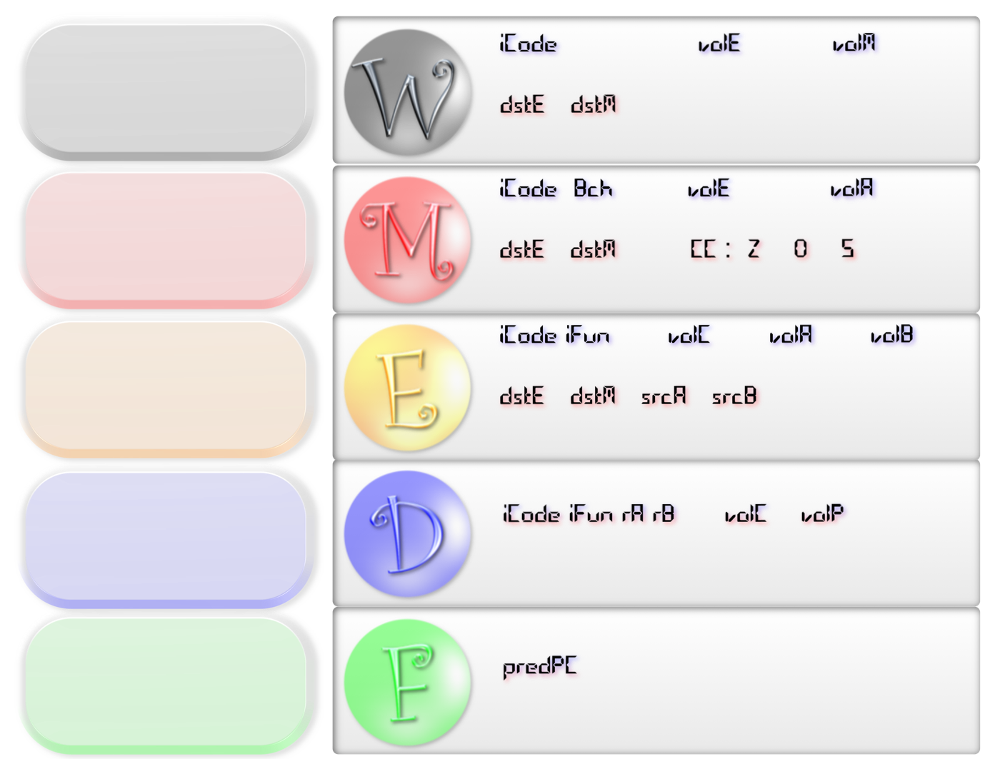

##<center>PIPE Simulator 用户手册</center>

###开发环境
- ####内核
	C++

- ####GUI

	C# (基于.NET Framework 4.5)，采用了部分DevExpress的框架。

###运行环境
Windows平台，.NET Framework 4.5支持。

###程序功能
####内核功能

- 实现了*Y86*指令集中的所有指令:

	**nop, halt
	rrmovl, irmovl, rmmovl, mrmovl
	addl, subl, andl, xorl
	jmp, jle, jl, je, jne, jge, jg
	call, ret
	pushl, popl**

- 实现了流水线控制逻辑, 避免数据冒险:

	**stall, bubble
	forward
	load/use hazard
	combination A&B**

- 额外支持的指令:

	**iaddl
	leave**

- 可供查看的信息:

	- 流水线寄存器
	- 组合逻辑块的线路值
	- 寄存器堆, 运行时内存栈
	- 当前时钟周期
	- Y86指令
	- 流水线控制机制: AllOK, Stall，Bubble

####界面功能
**主界面**

**运行程序时的界面，显示版本信息。开始模拟需要将.yo文件托入左下角示意处。之后进入执行界面。**
**这时可以调节CPU频率，程序提供多种频率，包括As fast as possible。点击相应按钮进行模拟。**
**运行界面，显示当前的状态。**
###使用说明
参照界面功能的说明，按照运行提示即可。注意不要同时拖入多个文件，如果拖入多个文件，只会模拟最后一个文件。
###实现细节
####内核
主要想法是按时序严格模拟. 具体说来, 首先是控制逻辑的更新: 我们根据流水线寄存器的值判断流水线的每个阶段是正常, **bubble**, 还是**stall**; 然后我们根据控制逻辑的结果来更新寄存器的值. 当寄存器的值被更新之后, 依赖于它们的组合逻辑单元的线路值也应该立即相应改变. 具体流程如下:
```cpp
void step(int cycle)
{
    ctrl();         // test each stage to determine whether it should be AOK, STA or BUB

    set_reg();      // set registers; usually these updates rely only on values obtained by logic units, but it is sometimes dependent on current state of that stage, when there are bubbles or stallings needed

    write();        // logic units; note that the order of these 5 stages are not arbitraty; it won't be a problem in curcuit, but it requires some care when we can only implement them in a linear manner

    memory(cycle);

    execute();

    decode();

    fetch();
}
```
至于逻辑单元和寄存器更新的实现细节, 可以参见源代码或教材.
####显示
拖入文件后程序会立即调用内核程序进行模拟，模拟结果以临时文件的形式进行储存，之后按照用户选定的条件演示模拟的过程。在下一次运行的时候会将上一次的临时文件删除。临时文件储存在程序所在路径下，文件名以**.yo**文件的文件名开头。包括了内存变化情况，寄存器状态。同时在**.yo**文件相同路径下生成要求的输出文件。
主要的展示模块，分别表示了流水线中的五个状态，指令会从F开始，依次通过左侧的圆形块，模拟流水线的形式。右侧则显示当前处于各个状态的具体信息。
窗口左下角的**Memory**显示内存的变化情况，顶部显示各个寄存器的状态。